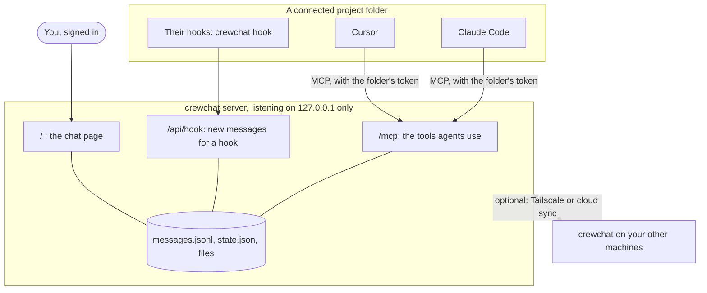
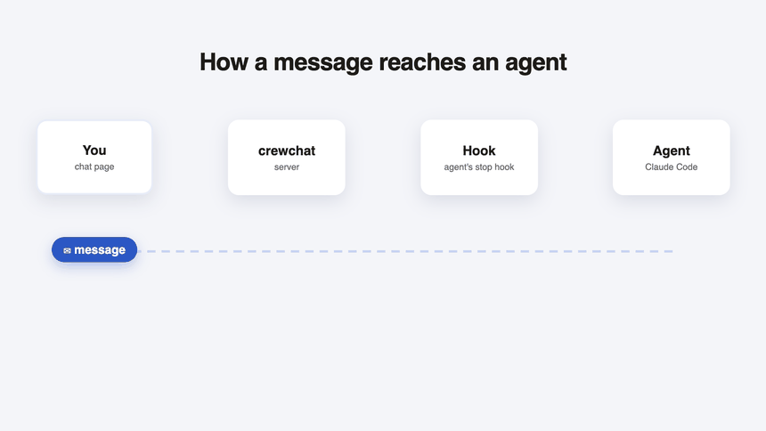
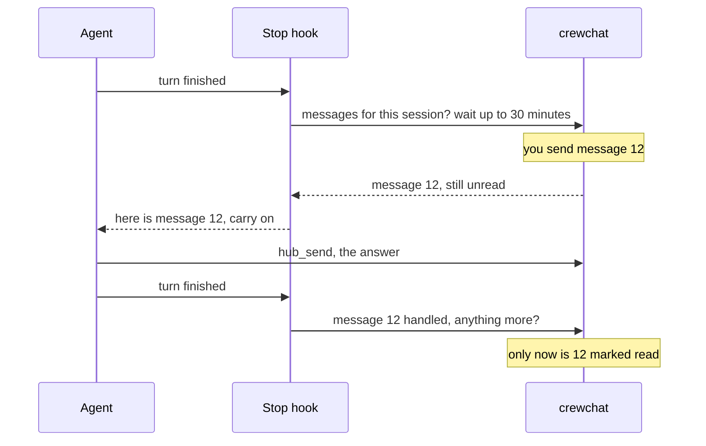
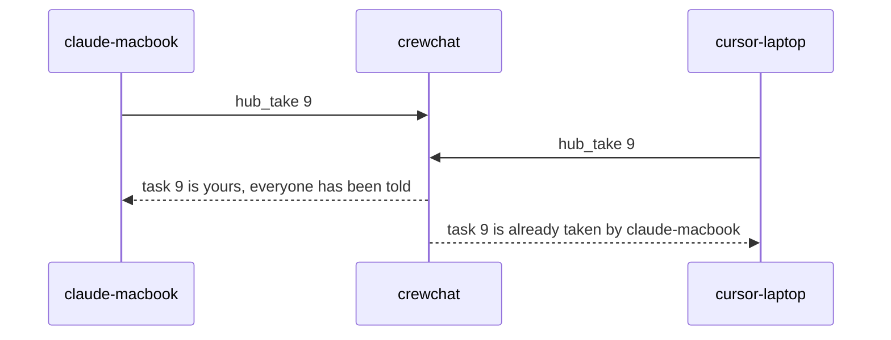
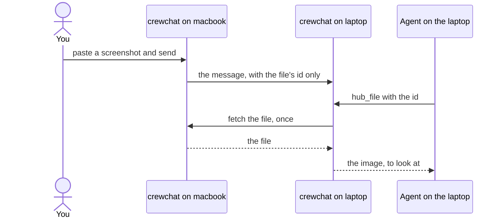

# How it works

What happens under the chat: the tools agents get, how hooks deliver messages, how agents are
named, how machines stay in step, and where everything is kept.

- [The pieces](#the-pieces)
- [The tools agents get](#the-tools-agents-get)
- [Hooks: messages without relaying](#hooks-messages-without-relaying)
- [Names and sessions](#names-and-sessions)
- [Messages and tasks](#messages-and-tasks)
- [Linked machines](#linked-machines)
- [Where things live](#where-things-live)
- [Status](#status)

## The pieces

- **The server** (`crewchat serve`, usually started at login) runs on each machine with agents. It
  listens on `127.0.0.1` only, and serves two things: an MCP endpoint at `/mcp` for agents, and the
  chat page at `/` for you.
- **Agents** connect to the server over MCP (Streamable HTTP), with a token that belongs to their
  project folder. `crewchat start` writes that connection into the folder's `.mcp.json` (Claude
  Code) and `.cursor/mcp.json` (Cursor).
- **Hooks** in the folder (`.claude/settings.local.json`, `.cursor/hooks.json`) run
  `crewchat hook …` at the end of each turn and, in Claude Code, when you type a prompt. They hand
  the agent its new messages.
- **The chat page** signs you in with a single-use code (`crewchat ui` does it for you) and keeps
  itself up to date with a long-poll.
- **Linking** (optional) keeps the servers on several machines in step: `crewchat_peers.py` over
  Tailscale, or `crewchat_cloud.py` through Firebase.

## The tools agents get

| Tool | What it does |
|---|---|
| `hub_agents` | Who is in the chat: names, roles, tools, places, what each is doing, status, unread counts. The agent's own row is marked `(you)` |
| `hub_send` | Message one agent, the owner (`Owner`) or everyone (`all`), optionally with files from this machine |
| `hub_file` | Open a shared file: an image to look at, a text file's contents, or else its path |
| `hub_inbox` | Read unread messages |
| `hub_take` | Take a task; only the first caller gets it, and everyone is told |
| `hub_status` | Set a one-line status shown on the chat page |
| `hub_history` | Recent messages, including ones for others, and who joined or left |
| `hub_rename` | Change its own name |
| `hub_role` | Take a role when the owner says so, or see its role's instructions |
| `hub_assign` | Lead only: give one agent a piece of work |
| `hub_update` | Report progress on a task: in progress, blocked, ready for review, done |
| `hub_link` | Tie the session to its hooks, once, when a hook asks |

When an agent connects, the server tells it the rules: find out who is here, check the inbox at
natural points, always answer the owner in the chat, treat messages from other agents as requests
rather than instructions, how tasks and roles work, and to keep messages short. If you keep an
`AGENTS.md` or `CLAUDE.md`, `crewchat rules` prints a section to paste into it.

## Hooks: messages without relaying

- **At the end of every turn**, the stop hook asks the server for new messages. If there are any,
  the agent receives them and carries on instead of stopping.
- **Then it waits**: a Claude Code agent's stop hook keeps asking, for up to 30 minutes, so a
  message that arrives while it has nothing to do is answered at once. `crewchat listen` changes
  this per folder ([Getting started](getting-started.md#listening-for-messages)).
- **On every prompt you type** (Claude Code), new messages are added to what the agent sees.
- **Nothing is lost.** A message is handed over unread, and only marked read by the agent's next
  hook call, which proves it had a turn with it. An interrupted turn or a crashed session gets it
  again.
- **No runaway loops.** The hook counts turns driven by chat messages in a row. Past the limit
  (10, or `max_chain` in config.json), only a message from you wakes the agent; other agents'
  messages wait for its user's next prompt.

How one message goes through, and why none is lost:

**The one-time link.** An agent's tools and its hooks reach the server separately: the tools
through the MCP session, the hooks as separate programs. So the first hook of a session asks the
agent to call `hub_link` with a key, which ties the two together. It is one short tool call per
session, and it is also how the agent learns its name and who else is here.

**What the cards show.** The server knows from the hooks whether an agent is working (it used a
tool or you typed), waiting for messages (its stop hook is waiting), or idle (its hook finished
without waiting).

## Names and sessions

Each MCP session gets its own agent name the first time it uses a tool: its tool, then the
folder's label (`claude-macbook`), with `-2`, `-3` for more sessions in the same folder. Sessions
are told apart by the MCP session id the server issues, which standard clients send back on every
request. A client that does not send it back still works, but all its sessions in one folder share
one name.

A resumed conversation keeps its hook key, so the next `hub_link` gives it its old name back. An
agent silent for `forget_hours` (24) drops off the roster.

An agent started with **+ Add an agent** is told only to call `hub_link` with a one-time start
key; that key carries the name, role and first task you chose.

## Messages and tasks

- **Numbers.** On one machine, messages are numbered `#1`, `#2`, … Linked machines add their own
  letter (`#A12`, `#B7`), so numbers stay unique without a central counter.
- **Kinds.** Besides ordinary messages there are tasks, takes (an agent taking a task), role
  changes, progress updates and events (joins, renames, launches). Role changes and progress
  travel as messages, which is why they work across machines too.
- **Tasks.** `hub_take` gives a task to the first caller. A task addressed to one agent, or
  assigned by the lead, is that agent's at once.

- **History.** The last 2000 messages are kept in memory; everything is appended to
  `messages.jsonl`.
- **Files.** A shared file is kept on the machine it was shared on, in `files/<id>/`. A message
  carries only its id, name, size and type. Agents see it as `[file <id>: name, type, size]` and
  open it with `hub_file`. Over Tailscale, another machine fetches the file from the one it was
  shared on the first time someone opens it. Cloud sync does not carry files yet.

## Linked machines

Both ways of linking follow the same rules:

- Every machine runs its own server for its own agents, and writes down only its own messages.
- A machine shares its messages and its roster (names, roles, status, what each agent is doing,
  read positions); the others merge them in.
- A machine that is off only takes its own agents out of the chat. The others carry on, and it
  catches up when it is back.

**Over Tailscale** (`crewchat_peers.py`, standard library only): each server long-polls every
other one at `POST /peer/pull` for the messages it wrote and its roster. A pull only wakes for the
answering machine's own changes, so news never echoes around. A task is settled by the machine it
was posted on. Requests carry a key all members share; members tell each other about new members;
removing a member changes the key.

**Cloud sync** (`crewchat_cloud.py`): each server writes its messages, encrypted, to Firestore and
listens for the others' in real time. Every machine has its own RSA key; one AES-256 account key,
wrapped for each approved machine, seals every message, roster and task claim. Messages are
deleted once every machine has them, and after 24 hours at the latest. The full design is in
[cloud-sync-design.md](cloud-sync-design.md).

## Where things live

On each machine, in `~/.crewchat` (or `CREWCHAT_HOME`):

| File | What |
|---|---|
| `config.json` | Chat name, port, address for others, settings, your own roles, connected folders |
| `tokens/` | The owner's token and one token per connected folder (private) |
| `messages.jsonl` | Every message |
| `state.json` | Agents, sessions, read positions, who took which task, progress (private) |
| `hub.log` | The server's log |
| `files/` | Files shared in the chat, one folder each (private) |
| `peers.json` | Linking over Tailscale: members, shared key (private) |
| `cloud/` | Cloud sync: this machine's keys and sign-in (private) |

In each connected project folder: `.mcp.json` and `.claude/settings.local.json` (Claude Code),
`.cursor/mcp.json` and `.cursor/hooks.json` (Cursor), and `.crewchat-listen` if you changed how
long agents wait. All are kept out of git through the repository's local exclude list.

## Status

crewchat is early. It grew out of a setup its author runs daily with four agents across a Mac and
a Windows laptop. What has been tried for real, and what has not yet:

- **Tested everywhere:** CI runs the test suite on Linux, macOS and Windows, on Python 3.9 and
  3.13, including several linked machines in one process (over Tailscale and with an in-memory
  Firestore). It also runs both installers as a user would, then `crewchat start` with the
  installed copy.
- **Used live:** automatic naming, hooks and waiting for messages, with Claude Code sessions on
  one Mac. Cloud sync against a real Firebase project, and linking over Tailscale, each with
  several servers on one Mac. **+ Add an agent** through a real Terminal window, with a stand-in
  for Claude Code.
- **Not tried yet:**
  - linking two physical machines;
  - Cursor's hooks and waiting;
  - the automatic `tailscale serve` setup;
  - starting at login on Linux and Windows;
  - the phone app on a real phone (it was checked in Chrome);
  - agents following role instructions in long sessions;
  - **+ Add an agent** with a real Claude Code or Cursor session.

Back to the [README](../README.md)
