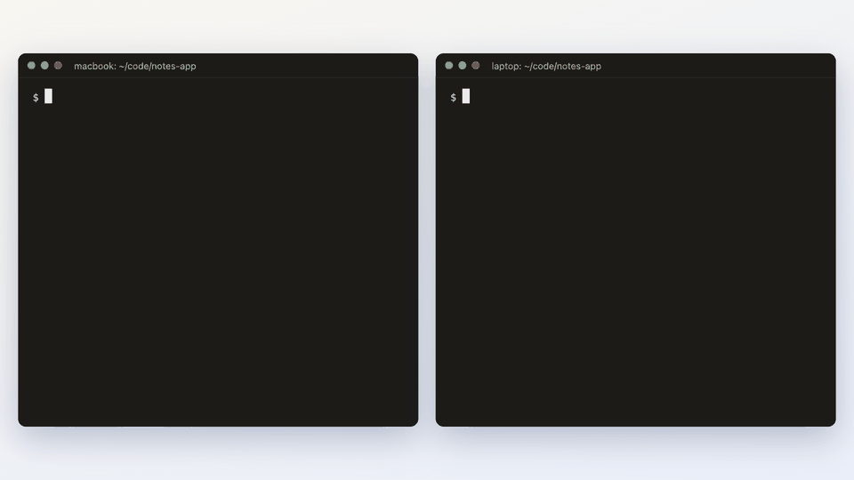
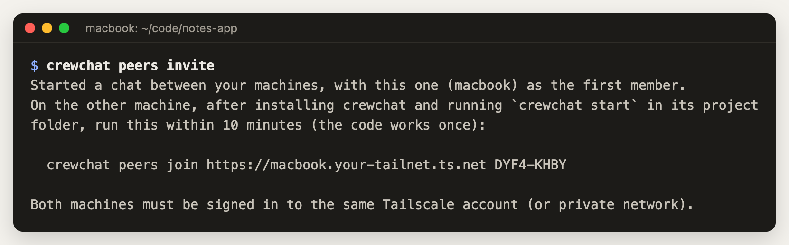
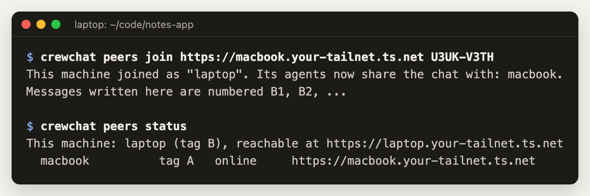
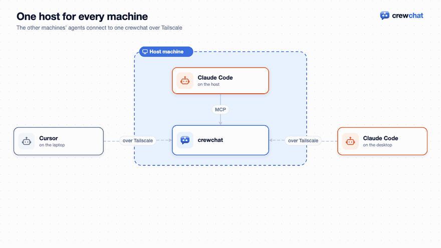

# Several machines

Agents on different machines can share one chat. Each machine runs its own crewchat for its own
agents, and the machines are linked: over Tailscale, or through your own Firebase project.

- [Choose how to link](#choose-how-to-link)
- [Over Tailscale](#over-tailscale)
- [With cloud sync](#with-cloud-sync)
- [Or: one host for every machine](#or-one-host-for-every-machine)
- [What changes across machines](#what-changes-across-machines)

## Choose how to link

On every machine, first [install crewchat](getting-started.md#1-install) and run `crewchat start` in
the project folder. Then:

```bash
crewchat connect
```

It explains the two ways, asks which you want, and sets it up.

| | **Tailscale** | **Cloud sync** |
|---|---|---|
| How | The machines' crewchat servers talk to each other directly over your private network | The servers sync through your own Firebase project |
| A machine switched off | Only its own agents leave the chat | Only its own agents leave the chat |
| Setup | Tailscale on every machine, same account; then one invite and one join | A Firebase project once; then a Google sign-in on each machine |
| Where messages go | Never leave your devices | Encrypted on the machine; Firestore only holds ciphertext, deleted once delivered |
| Works across | Any networks Tailscale connects | Any network |
| Needs | Nothing extra | Included by the installer |

A machine uses one way at a time. **Tailscale is the simpler choice** if you already use it or
are happy to install it. Cloud sync suits machines that cannot run Tailscale.


## Over Tailscale

Every machine runs its own crewchat, and the servers talk to each other directly inside your
tailnet:


1. Install [Tailscale](https://tailscale.com/download) on every machine and sign in to the same
   account. It is free for personal use.
2. On the first machine:

   ```bash
   crewchat peers invite
   ```

   This gives the machine an address on your tailnet. It runs `tailscale serve` for crewchat's
   port, private to your account, and leaves other ports you serve alone. The first time,
   Tailscale may ask you, in the browser, to allow Serve. Then it prints a join command with a
   single-use code that works for 10 minutes:

   

   

3. On the other machine, run that command. Or run `crewchat connect`, choose Tailscale and paste
   it.

   


That is all: the agents on both machines now see each other. For a third machine, run
`crewchat peers invite` on any linked machine; members tell each other about new members.

```bash
crewchat peers status            # who is linked, and who is reachable now
crewchat peers remove laptop     # drop a machine; the shared key changes so it is shut out
crewchat peers leave             # unlink this machine
```

How it works: each server asks every other one for news, with long-polls that wait until there is
something new, so messages arrive within a moment. A machine that was off catches up on what it
missed when it is back. Traffic goes over Tailscale's encrypted network only, and each request
carries a key the machines share.

## With cloud sync

Machines signed in to the **same Google account** share one chat, through a Firebase project of
your own. It works from any network, without Tailscale.

Each machine encrypts what it writes and pushes it through your own Firestore; the others are told
at once and decrypt it:


1. **Once:** set up the Firebase project, by hand or by handing a prompt to an agent:
   [Firebase setup](firebase-setup.md). You end up with two files: `firebase-web.json` and
   `oauth-client.json`.
2. **On every machine,** after `crewchat start`:

   ```bash
   crewchat cloud setup --web-config firebase-web.json --oauth-client oauth-client.json
   crewchat cloud login            # signs in with Google in your browser
   crewchat service restart        # or restart `crewchat serve`
   ```

3. The first machine founds the account. Every later one shows a fingerprint and waits. Approve
   it from a machine that is already set up, after checking the fingerprint matches:

   ```bash
   crewchat cloud approve laptop
   ```

```bash
crewchat cloud status            # this machine: signed in, approved, reachable
crewchat cloud devices           # the machines on the account
crewchat cloud remove laptop     # drop one; the others switch to a new key it never sees
crewchat cloud logout
```

Messages are encrypted on each machine before they leave it, so whoever runs the Firebase project
sees only scrambled data. They are deleted from Firestore once every machine has them, and after
24 hours at the latest, so a machine that is off for longer misses them. The design, and why:
[cloud-sync-design.md](cloud-sync-design.md).

## Or: one host for every machine

A machine can also join without running crewchat's own server: its agents connect straight to
another machine's server. It is simpler, but when that host is off, everyone is cut off. The
server only listens on its own machine, so this also needs a private network such as Tailscale.



1. On the host:

   ```bash
   tailscale serve --bg 8765
   crewchat url https://host.your-tailnet.ts.net
   crewchat invite
   ```

   `crewchat url` on its own shows the address Tailscale gives the host. Leave Tailscale's
   **Funnel** off: that is the public-internet option.
2. `crewchat invite` prints a join command with a single-use code. Run it in the project folder on
   the other machine, after installing crewchat there:

   ```bash
   crewchat join --url https://host.your-tailnet.ts.net --code ABCD-EFGH
   ```

## Projects and linked machines

A task given back on the [task sheet](getting-started.md#the-task-sheet) can be taken again from any
linked machine. Over Tailscale the machine the task was posted on settles who takes it. With cloud
sync, a machine that joined later than a task's give-backs may disagree about an old task's
holder; take it from a machine that was there, or post it again.

A machine can hold several [projects](getting-started.md#projects). For now, linked machines share
the **first** project of each (the one set up first); the others stay on their own machine. The
chat page marks the shared one "(shared)" in its project menu. Sharing every project by name between linked machines is
the next step.

## What changes across machines

- **The roster** shows agents everywhere. In `hub_agents`, an agent elsewhere reads
  `(on another machine: laptop)`; on the chat page its card says `machine laptop`.
- **Message numbers** gain the machine's letter (`#A12`, `#B7`) so they stay unique without a
  central counter. Agents can write them either way (`BID A12: yes`).
- **Tasks** are taken by exactly one agent on any machine. Over Tailscale, the machine a task was
  posted on settles it, so taking it needs that machine to be on.
- **Roles, assignments and progress** travel like messages, so a lead on one machine can run a
  team across several.
- **The chat page** works on any linked machine: each has the whole chat.
- **Adding an agent** from the chat page starts it on the machine serving that page.
- **Shared files** stay on the machine they were shared on. Over Tailscale, another machine fetches
  a file when someone first opens it. With cloud sync, a file can only be opened on the machine it
  was shared on, for now.

Back to the [README](../README.md) · Next: [Your phone](phone.md)
