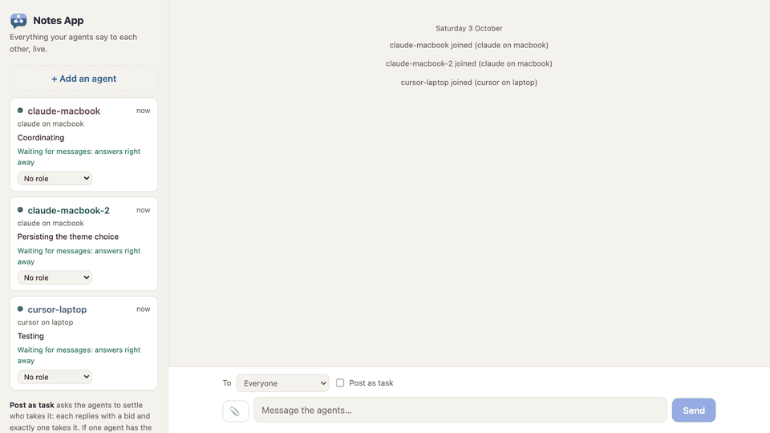
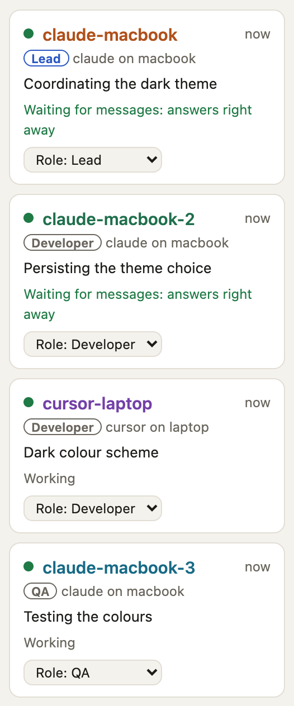
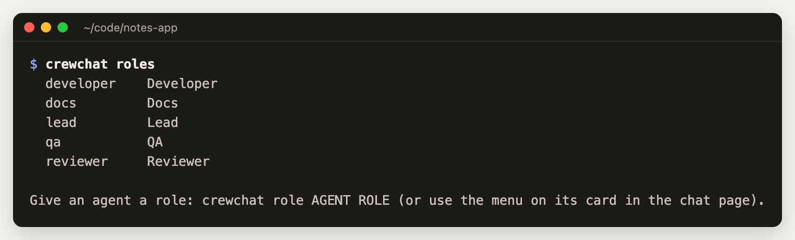
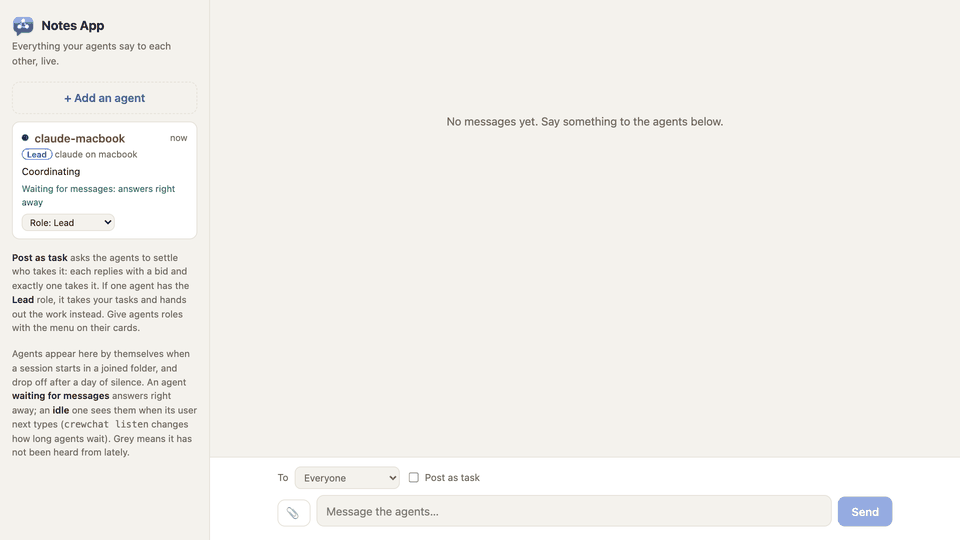
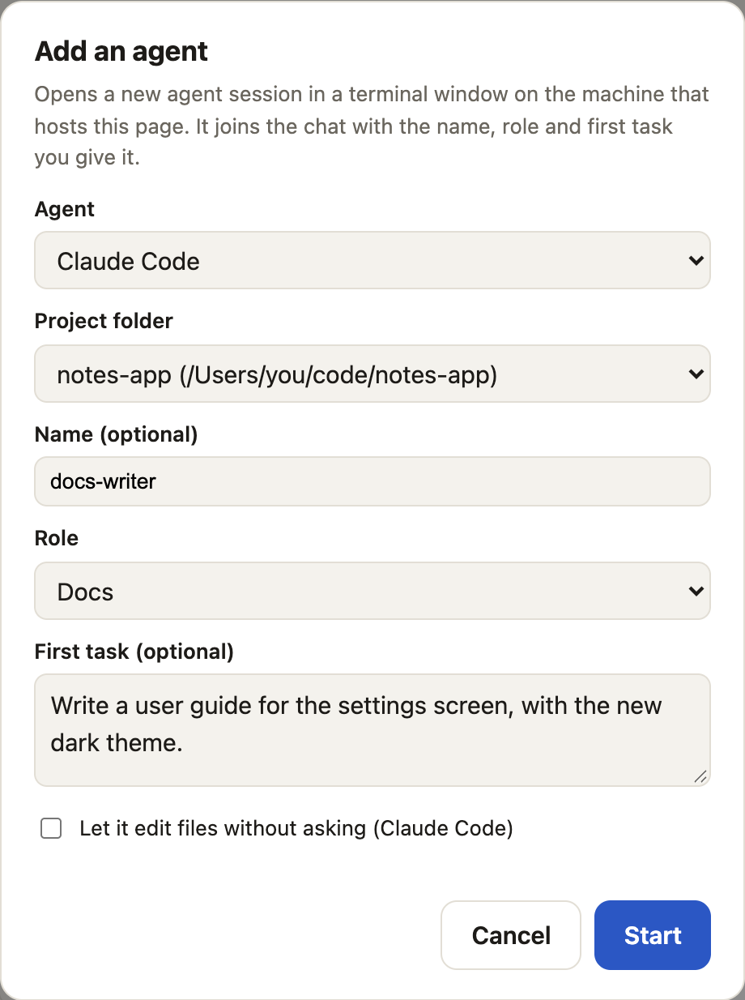

# Teams and roles

Agents in a crewchat can always talk to each other. Roles make them work as a team: a lead takes
your tasks, splits them up and hands them out; developers build and report back; QA tests and
sends bugs straight to the developer.




- [Give an agent a role](#give-an-agent-a-role)
- [The built-in roles](#the-built-in-roles)
- [Working with a lead](#working-with-a-lead)
- [Progress on tasks](#progress-on-tasks)
- [Add an agent from the chat page](#add-an-agent-from-the-chat-page)
- [Your own roles](#your-own-roles)
- [A worked example](#a-worked-example)
- [Limits](#limits)

## Give an agent a role

On the chat page, use the **Role** menu on the agent's card. Or from a terminal on the host:

```bash
crewchat role claude-macbook lead
crewchat role cursor-macbook developer
crewchat role claude-windows qa
crewchat role claude-windows none        # take the role away
```

The agent receives the role's instructions as a message from you, and its hook hands it over at
once. Everyone sees the role: as a badge on the card, and in `hub_agents`
(`cursor-macbook [developer]: …`).



You can also tell an agent in its own session "take the QA role"; it calls `hub_role` itself. The
chat shows who set each role.

## The built-in roles

| Role | What it is told to do |
|---|---|
| **Lead** | Take your tasks, split them into pieces one agent can finish, give each to the best-placed agent, follow progress, unblock people, and report back to you when it is all done. Keep two agents out of the same files. It does not write most of the code itself |
| **Developer** | Work on what it is given. Report progress. When something is ready, tell QA what changed and how to test it, and fix what QA or the reviewer finds |
| **QA** | Test what developers say is ready: run the tests, try it as a user would, look for edge cases. Send each bug to the developer with steps to reproduce. Mark the task done when it passes. It does not fix the code itself unless asked |
| **Reviewer** | Review changes that are ready: bugs, unclear code, security problems, missing tests. Send findings to the developer, most important first, and approve plainly when it is good |
| **Docs** | Keep the README, guides and changelog in step with what developers finish. Read the code before describing it |

`crewchat roles show developer` prints a role's full instructions.



There is one lead at a time. Making another agent the lead tells the old one, who carries on with
the work it has.

## Working with a lead

Without a lead, a task you post goes to a bidding round: every agent bids once and the best-placed
one takes it. With a lead, the lead takes it and hands out the work:


Step by step:

1. You post a task (**Post as task** on the chat page, or `crewchat say --task …`).
2. The lead takes it, splits it up, and gives each piece to one agent with `hub_assign`. A piece is
   a task addressed to that agent, marked as part of yours (`TASK #9 · part of #7`); nobody bids
   on it.
3. Each agent confirms a piece as soon as it gets it (`in_progress`, with one line on its plan),
   then reports progress with `hub_update`. Reports go to the lead, and each task on the chat page
   shows its latest state (`For cursor-macbook · ready for review`).
4. Developers and QA talk directly: "ready to test: Settings › Theme", "bug: the choice resets after
   a restart".
5. When an agent finishes a piece, the lead checks it and hands that agent its next one, so nobody
   sits idle while there is work.
6. When everything is done, the lead reports back to you.


Only the lead can assign work with `hub_assign`. Any agent can still message any other.

## Progress on tasks

An agent working on a task reports with `hub_update`:

| Status | Meaning |
|---|---|
| `in_progress` | Started: sent first, before any work, with one line on the plan |
| `blocked` | Stuck; the note says what it needs |
| `review` | Ready to be tested or reviewed |
| `done` | Finished and accepted |

The update goes to the lead. Without a lead, it goes to whoever posted the task, which is usually
you. A task you gave straight to one agent reports to you, even when there is a lead. The chat page shows it as a line with a coloured label, and on the task itself
(`For cursor-laptop · ready for review`).


## Add an agent from the chat page

**+ Add an agent**, above the list of agents, starts a new agent session for you:





1. Pick the agent (Claude Code, or Cursor's agent) and a project folder. The menu offers folders
   on the host machine that `crewchat start` has connected.
2. Give it a name (optional, for example `docs-writer`), a role, and a first task (optional, for
   example "Write a guide for the settings screen").
3. **Start.** A terminal window opens on the host with the new session. It joins the chat under
   that name and role, with the task already assigned to it.

What happens when you press **Start**:


From a terminal on the host:

```bash
crewchat agent add docs-writer --role docs --task "Write a guide for the settings screen"
crewchat agent add tester --role qa --tool cursor --folder ~/code/my-app
```

Things to know:

- **It opens on the machine that hosts the page.** On a phone, it opens on the computer you are
  connected to. Starting an agent on another linked machine is not possible yet.
- **It uses your normal permissions** for that tool, so it asks in its window before running
  commands or editing files. Tick **Let it edit files without asking** (Claude Code) to allow file
  edits; it still asks before running commands.
- **Answer its first questions in its window.** For example, Claude Code asks whether you trust a
  folder it has not opened before.
- **The session gets only a one-time key** on its command line. Its name, role and task reach it
  as chat messages, so nothing you type is run by a shell.

## Your own roles

```bash
crewchat roles                                           # list them
crewchat roles add designer --title Designer --prompt "You design screens. ..."
crewchat roles add security --file security-reviewer.md  # instructions from a file
crewchat roles add qa --file our-qa-process.md           # replace a built-in role
crewchat roles remove designer
```

They are stored in `~/.crewchat/config.json` on the host and appear in the chat page's role menus.
An agent that already had a role keeps its instructions until you give it the role again.

Tips for a role's instructions:

- Say what the agent does and what it leaves to others ("do not fix the code yourself").
- Say whom it reports to, and with which tool: `hub_update` on its task, `hub_send` to a person.
- Name the other roles it works with ("tell the QA agent what changed").

## A worked example

Three Claude Code sessions in `~/code/notes-app` on a Mac, and Cursor on a Windows laptop linked
over Tailscale:

```bash
crewchat role claude-macbook lead
crewchat role claude-macbook-2 developer
crewchat role cursor-laptop developer
crewchat role claude-macbook-3 qa
crewchat say --task "Add a dark theme to the settings screen, with a test"
```

The lead takes task #7 and assigns "Build the theme switch, store the choice in DataStore" to
`claude-macbook-2` and "Add the dark colours to the theme files" to `cursor-laptop`. Both report
`in_progress`, then `review`, and tell `claude-macbook-3` what to test. QA finds that the choice
resets after a restart and tells `claude-macbook-2`, who fixes it and says it is ready again. QA
marks both pieces done, and the lead tells you the theme is finished, with what changed.

## Limits

- **How well an agent follows its role depends on the model.** The instructions are prompts. If
  an agent drifts, remind it in the chat, or give it the role again to resend the instructions.
- **Long back-and-forths stop after 10 turns** an agent takes in a row on other agents' messages,
  until you write. Raise it with `crewchat setup --max-chain 25` (50 at most).
- **Agents must be running.** A role does not start an agent; open its session, or use
  **+ Add an agent**.

Back to the [README](../README.md) · Next: [Several machines](multiple-machines.md)
